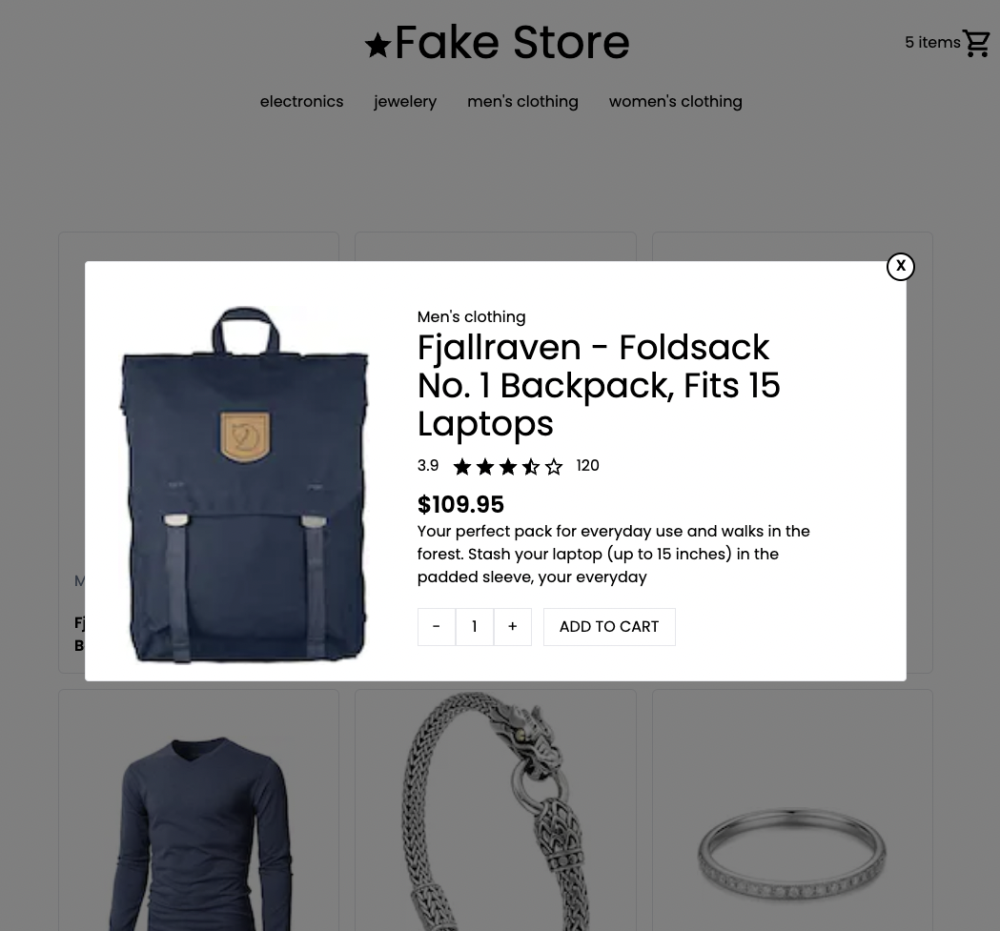

# Nextjs E-commerce site

This repository contains the source code for an example E-commerce site, built using Next.js and using the fakestore api and Zustand.

## Preview

[E-commerce on Vercel](https://next-e-commerce-weld.vercel.app/)

## Features

- **Next.js**: The React framework for building efficient and interactive user interfaces.
- **TailwindCSS**: Utility-first CSS framework
- **fakeStoreApi**: fakeStoreApi is a free online REST API that you can use whenever you need Pseudo-real data for your e-commerce or shopping website without running any server-side code
- **Zustand**: A small, fast and scalable bearbones state-management solution using simplified flux principles

#### Clone the repo

`git clone https://github.com/joemeers82/next-e-commerce`

#### Navigate to cloned directory

`cd next-e-commerce`

#### Install dependencies

`npm install`

#### Run the development server

`npm run dev`
